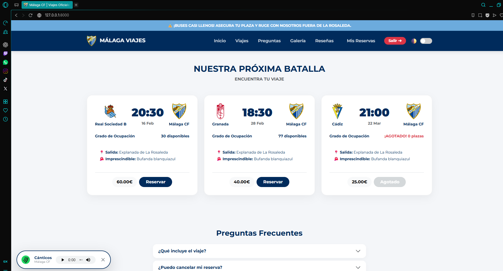
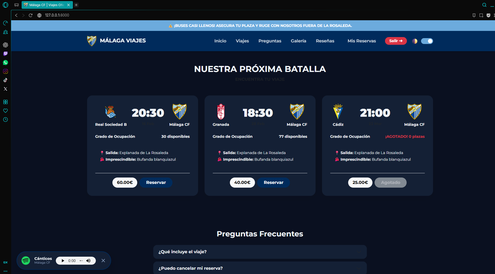
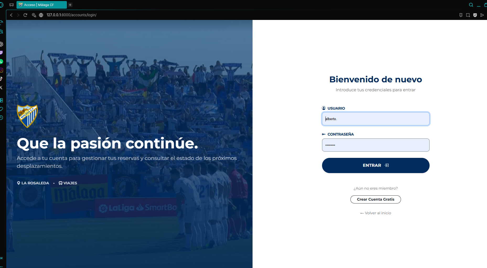
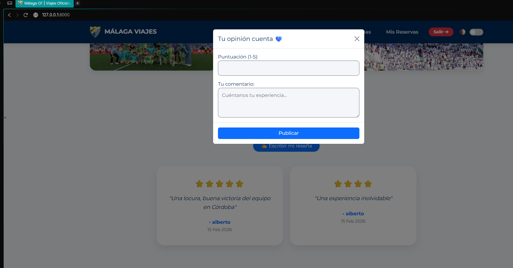
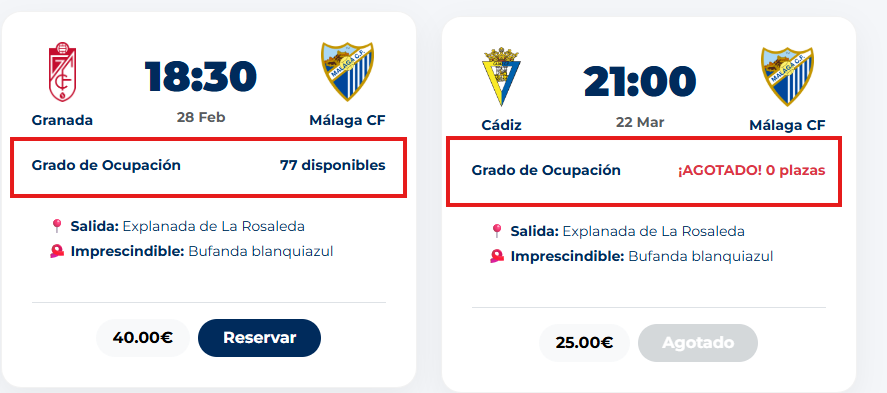

# 💙🤍 MÁLAGA CF VIAJES | Portal de Desplazamientos Oficiales


> **"Porque nunca jugaréis solos"**. Plataforma web integral para la gestión de reservas de autobús, organización de la afición y comunidad malaguista.

---

## 📋 Descripción del Proyecto

Este proyecto es una aplicación web Full-Stack desarrollada con **Django** que moderniza la forma en que los aficionados del Málaga CF reservan su plaza para acompañar al equipo.

Lejos de ser un simple formulario, la aplicación ofrece una **experiencia de usuario inmersiva** con diseño responsivo, temas visuales adaptables (Día/Noche) y elementos multimedia interactivos.

---

## ✨ Características Principales

### 👤 Experiencia de Usuario (Frontend)
* **Gestión de Reservas:** Visualización de plazas disponibles .
* **Modo Oscuro "Noche Malaguista":** Un tema visual personalizado con tonos azul marino profundo y textos claros para reducir la fatiga visual.
* **Autenticación Moderna:** Pantallas de Login y Registro con diseño "Split-Screen" (Imagen emocional + Formulario).
* **Sistema de Reseñas:** Los aficionados pueden valorar los viajes y dejar comentarios que se muestran en tarjetas con diseño "glassmorphism".
* **Reproductor Flotante:** Componente de audio persistente para escuchar cánticos del estadio mientras se navega.
* **Galería Interactiva:** Sección multimedia con efectos de zoom al pasar el cursor.

### 🛠️ Panel de Administración y Backend
* **Control de Aforo:** Lógica de negocio que impide automáticamente nuevas reservas cuando se alcanza el límite de plazas (`plazas_totales`).
* **Panel Privado:** Sección "Mis Reservas" donde el usuario puede consultar sus tickets y anular plazas si surge un imprevisto.
* **Gestión de Datos:** Modelos relacionales robustos (SQLite) para Viajes, Inscripciones y Reseñas.

---

## 📸 Galería del Proyecto

| 🏠 Pantalla de Inicio (Light) | 🌙 Modo Noche Malaguista |
|:---:|:---:|
|  |  |
| *Vista general con tarjetas de partidos.* | *Adaptación visual para entornos oscuros.* |

| 🔐 Login & Registro | 🗣️ Reseñas de la Afición |
|:---:|:---:|
|  |  |
| *Acceso seguro para usuarios.* | *Opiniones reales de los viajeros.* |

| 🎵 Multimedia | 🎫 Gestión de Plazas |
|:---:|:---:|
|  |  |
| *Reproductor de cánticos flotante.* | *Alertas de aforo completo.* |

---

## 🚀 Tecnologías Utilizadas

* **Lenguaje:** Python 3.12
* **Framework Web:** Django 5.0
* **Estilos:** CSS, Bootstrap 5.3, Bootstrap Icons.
* **Base de Datos:** SQLite3.
* **Herramientas:** VS Code, Git/GitHub.

---

## 🔧 Instalación y Despliegue Local

Si deseas probar el proyecto en tu máquina:

1.  **Clonar el repositorio:**
    ```bash
    git clone (https://github.com/albertomancera/malaga_viajes.git)
    cd malaga_viajes
    ```

    

2.  **Crear entorno virtual:**
    ```bash
    python -m venv venv
    source venv/bin/activate  # En Mac/Linux
    .\venv\Scripts\activate   # En Windows
    ```

3.  **Instalar dependencias:**
    ```bash
    pip install django pillow openpyxl
    ```

4.  **Ejecutar migraciones:**
    ```bash
    python manage.py migrate
    ```

5.  **Crear superusuario (Admin):**
    ```bash
    python manage.py createsuperuser
    ```

6.  **Lanzar servidor:**
    ```bash
    python manage.py runserver
    ```

Accede a la web en: `http://127.0.0.1:8000/`

---

## 👨‍💻 Autor

Desarrollado con pasión por **Alberto Mancera Plaza**.
*Estudiante de Desarrollo de Aplicaciones Web.*

---
